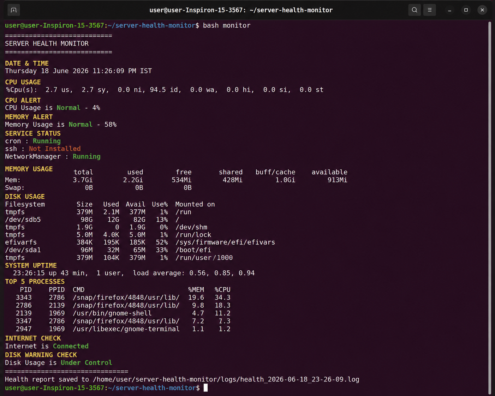
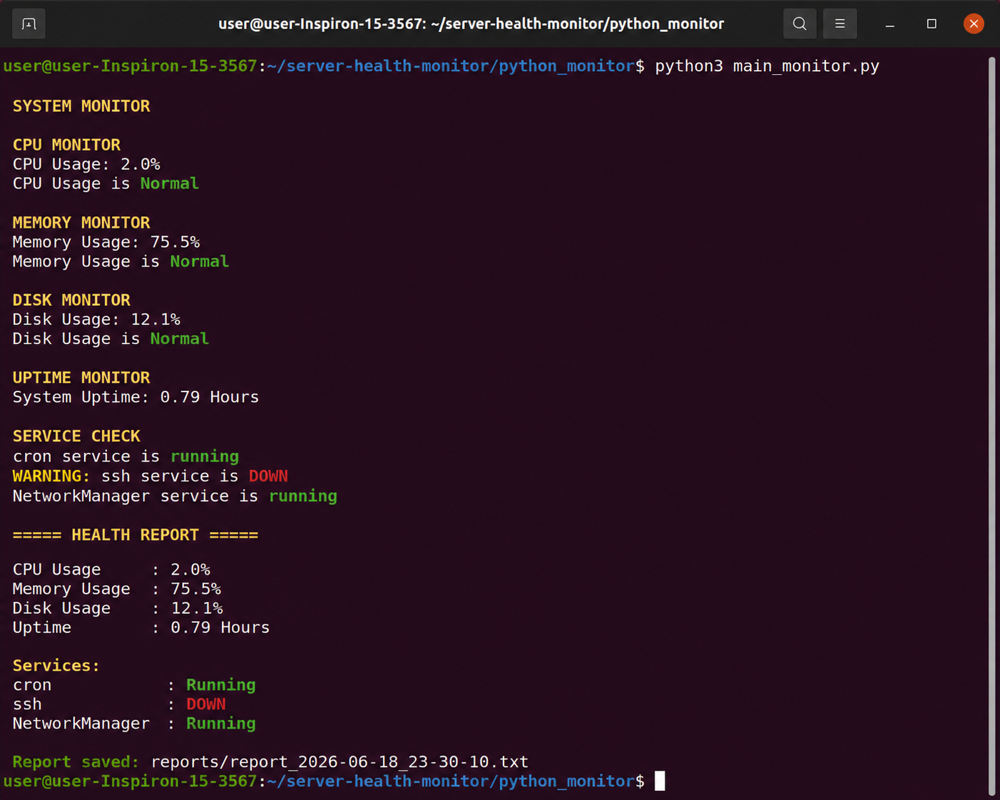
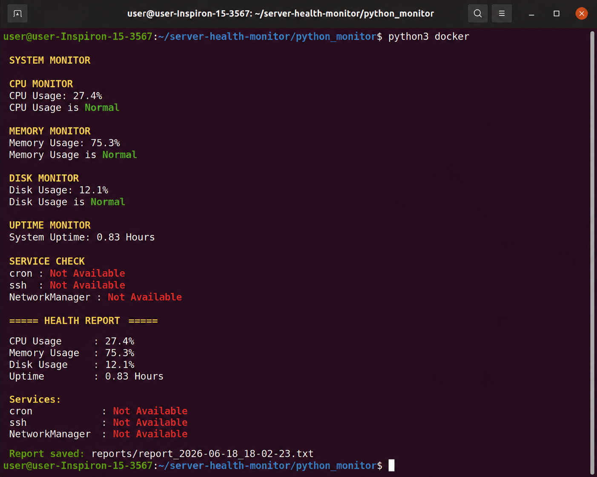
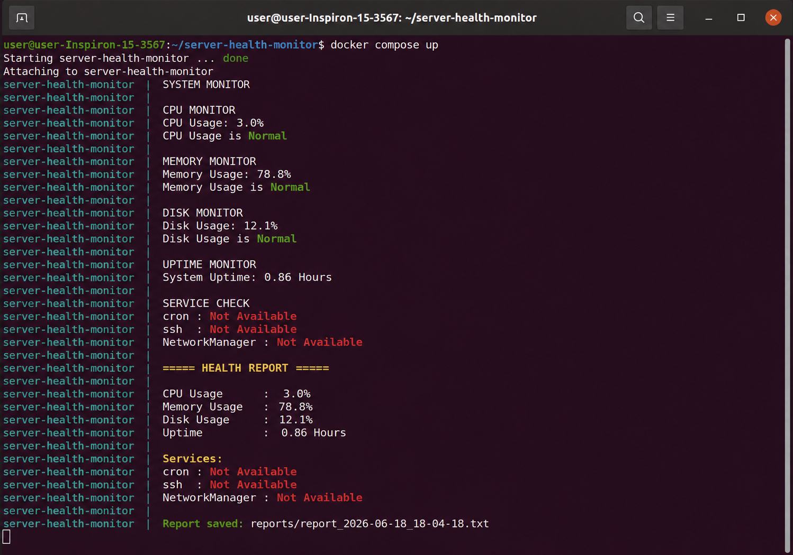
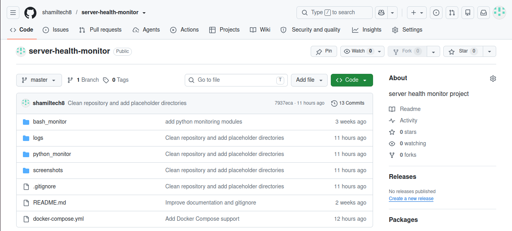

# 🚀 Server Health Monitor


---

## 📖 Project Overview

**Server Health Monitor** is a Linux-based monitoring and automation project developed using **Bash**, **Python**, **Docker**, and **Docker Compose**.

The project continuously monitors essential server resources such as CPU usage, memory utilization, disk usage, system uptime, and critical services. It generates detailed health reports, supports configurable monitoring through JSON configuration files, performs automatic log cleanup, and demonstrates practical Linux system administration and DevOps automation skills.

The project contains two independent implementations:

- 🖥️ Bash Monitoring System
- 🐍 Python Monitoring System

This project was created to strengthen practical skills in:

- Linux Administration
- Python Automation
- Bash Scripting
- Docker
- Docker Compose
- Git & GitHub
- DevOps Fundamentals

---

# ✨ Features

## 🖥️ Bash Monitor

- ✅ CPU Monitoring
- ✅ Memory Monitoring
- ✅ Disk Monitoring
- ✅ Uptime Monitoring
- ✅ Service Status Monitoring
- ✅ Internet Connectivity Check
- ✅ Top Running Processes
- ✅ Disk Warning Detection
- ✅ Health Report Generation
- ✅ Automatic Log Cleanup

---

## 🐍 Python Monitor

- ✅ CPU Monitoring
- ✅ Memory Monitoring
- ✅ Disk Monitoring
- ✅ Uptime Monitoring
- ✅ Service Monitoring
- ✅ JSON Configuration Support
- ✅ Logging Module
- ✅ Health Report Generation
- ✅ Email Alert Module
- ✅ Automatic Log Cleanup
- ✅ Docker Support
- ✅ Docker Compose Support

---

# 🛠 Technologies Used

| Technology | Purpose |
|------------|----------|
| Python | System Monitoring |
| Bash | Linux Automation |
| Linux (Ubuntu) | Operating System |
| Docker | Containerization |
| Docker Compose | Multi-container Management |
| Git | Version Control |
| GitHub | Source Code Hosting |
| JSON | Configuration Management |
| psutil | System Information |

---

# 📂 Project Structure

```text
server-health-monitor/
│
├── bash_monitor/
│   ├── monitor.sh
│   ├── cpu_monitor.sh
│   ├── memory_monitor.sh
│   ├── service_monitor.sh
│   ├── main_monitor.sh
│   └── monitor_backups.sh
│
├── python_monitor/
│   ├── main_monitor.py
│   ├── cpu_monitor.py
│   ├── memory_monitor.py
│   ├── disk_monitor.py
│   ├── uptime_monitor.py
│   ├── service_monitor.py
│   ├── logger.py
│   ├── report_generator.py
│   ├── report_writer.py
│   ├── config_loader.py
│   ├── email_alert.py
│   ├── log_cleanup.py
│   ├── Dockerfile
│   ├── requirements.txt
│   └── config.json
│
├── screenshots/
├── logs/
├── docker-compose.yml
├── README.md
└── .gitignore
```
---

# ⚙️ Installation

## Clone the Repository

```bash
git clone https://github.com/shamiltech8/server-health-monitor.git
```

Navigate into the project directory:

```bash
cd server-health-monitor
```

---

# 📦 Python Requirements

Navigate to the Python monitor directory:

```bash
cd python_monitor
```

Install the required Python packages:

```bash
pip install -r requirements.txt
```

Required packages include:

- psutil
- python-dotenv

---

# 🖥️ Running the Bash Monitor

Navigate to the Bash monitor directory:

```bash
cd bash_monitor
```

Make the script executable:

```bash
chmod +x monitor.sh
```

Run the monitor:

```bash
./monitor.sh
```

The Bash monitor performs:

- CPU Monitoring
- Memory Monitoring
- Disk Monitoring
- Service Monitoring
- Internet Connectivity Check
- Top Running Processes
- Automatic Log Cleanup
- Health Report Generation

Generated log files are stored inside:

```text
logs/
```

---

# 🐍 Running the Python Monitor

Navigate to:

```bash
cd python_monitor
```

Run the monitor:

```bash
python3 main_monitor.py
```

The Python monitor performs:

- CPU Monitoring
- Memory Monitoring
- Disk Monitoring
- Uptime Monitoring
- Service Monitoring
- JSON Configuration
- Logging
- Report Generation
- Email Alert Support
- Automatic Log Cleanup

Reports are stored inside:

```text
python_monitor/reports/
```

---

# 🐳 Running with Docker

Navigate to the Python monitor directory:

```bash
cd python_monitor
```

Build the Docker image:

```bash
docker build -t server-health-monitor .
```

Run the Docker container:

```bash
docker run --rm server-health-monitor
```

---

# ⚙️ Running with Docker Compose

Navigate to the project root:

```bash
cd server-health-monitor
```

Build the application:

```bash
docker-compose build
```

Run the application:

```bash
docker-compose up
```

Stop the application:

```bash
docker-compose down
```

---

# 📋 Sample Output

Example console output:

```text
SYSTEM MONITOR

CPU MONITOR
CPU Usage: 8.4%
CPU Usage is Normal

MEMORY MONITOR
Memory Usage: 42%

DISK MONITOR
Disk Usage: 13%

UPTIME MONITOR
System Uptime: 15.4 Hours

SERVICE CHECK
cron : Running
NetworkManager : Running

===== HEALTH REPORT =====

Report saved successfully.
```

---
# 📸 Screenshots

Below are screenshots demonstrating the project in action.

---

## 🖥️ Bash Monitor

The Bash monitoring script checks CPU, memory, disk usage, services, internet connectivity, and generates a health report.



---

## 🐍 Python Monitor

The Python version provides a modular implementation with logging, configuration support, report generation, and email alert capability.



---

## 🐳 Docker Container

Running the monitoring application inside a Docker container.



---

## ⚙️ Docker Compose

Running the project using Docker Compose.



---

## 🌐 GitHub Repository

Project hosted on GitHub with complete source code and documentation.



---

# 🔄 Project Workflow

```text
                    Server

                       │

         ┌─────────────┼─────────────┐

         │             │             │

      CPU Check    Memory Check   Disk Check

         │             │             │

         └─────────────┼─────────────┘

                       │

                 Uptime Monitor

                       │

                Service Monitoring

                       │

               Internet Connectivity

                       │

                  Logger Module

                       │

             Health Report Generator

                       │

          Automatic Log Cleanup

                       │

          Email Alert (Python Version)

                       │

                 Report Saved
```

---

# 📊 Monitoring Components

| Component | Bash | Python |
|-----------|:----:|:------:|
| CPU Monitoring | ✅ | ✅ |
| Memory Monitoring | ✅ | ✅ |
| Disk Monitoring | ✅ | ✅ |
| Uptime Monitoring | ✅ | ✅ |
| Service Monitoring | ✅ | ✅ |
| Internet Check | ✅ | ❌ |
| JSON Configuration | ❌ | ✅ |
| Logging | Basic | Advanced |
| Email Alerts | ✅ | ✅ |
| Docker Support | ❌ | ✅ |
| Docker Compose | ❌ | ✅ |
| Automatic Log Cleanup | ✅ | ✅ |

---

# 💼 Skills Demonstrated

This project demonstrates practical experience with:

### 🐧 Linux

- Linux Command Line
- File Permissions
- Service Management
- Process Monitoring

### 🖥️ Bash

- Shell Scripting
- Automation
- Conditional Statements
- Loops
- Functions

### 🐍 Python

- Modular Programming
- System Monitoring
- File Handling
- Exception Handling
- JSON Configuration

### 🐳 Docker

- Docker Images
- Docker Containers
- Dockerfile
- Docker Compose

### 🔧 DevOps

- Automation
- Logging
- Monitoring
- Configuration Management
- Version Control

### 🌐 Git & GitHub

- Repository Management
- Commits
- Branches
- Version History

---
# 📸 Screenshots

Below are screenshots demonstrating the project in action.

---

## 🖥️ Bash Monitor

The Bash monitoring script checks CPU, memory, disk usage, services, internet connectivity, and generates a health report.


---

## 🐍 Python Monitor

The Python version provides a modular implementation with logging, configuration support, report generation, and email alert capability.


---

## 🐳 Docker Container

Running the monitoring application inside a Docker container.


---

## ⚙️ Docker Compose

Running the project using Docker Compose.


---

## 🌐 GitHub Repository

Project hosted on GitHub with complete source code and documentation.


---

# 🔄 Project Workflow

```text
                    Server

                       │

         ┌─────────────┼─────────────┐

         │             │             │

      CPU Check    Memory Check   Disk Check

         │             │             │

         └─────────────┼─────────────┘

                       │

                 Uptime Monitor

                       │

                Service Monitoring

                       │

               Internet Connectivity

                       │

                  Logger Module

                       │

             Health Report Generator

                       │

          Automatic Log Cleanup

                       │

          Email Alert (Python Version)

                       │

                 Report Saved
```

---

# 📊 Monitoring Components

| Component | Bash | Python |
|-----------|:----:|:------:|
| CPU Monitoring | ✅ | ✅ |
| Memory Monitoring | ✅ | ✅ |
| Disk Monitoring | ✅ | ✅ |
| Uptime Monitoring | ✅ | ✅ |
| Service Monitoring | ✅ | ✅ |
| Internet Check | ✅ | ❌ |
| JSON Configuration | ❌ | ✅ |
| Logging | Basic | Advanced |
| Email Alerts | ✅ | ✅ |
| Docker Support | ❌ | ✅ |
| Docker Compose | ❌ | ✅ |
| Automatic Log Cleanup | ✅ | ✅ |

---

# 💼 Skills Demonstrated

This project demonstrates practical experience with:

### 🐧 Linux

- Linux Command Line
- File Permissions
- Service Management
- Process Monitoring

### 🖥️ Bash

- Shell Scripting
- Automation
- Conditional Statements
- Loops
- Functions

### 🐍 Python

- Modular Programming
- System Monitoring
- File Handling
- Exception Handling
- JSON Configuration

### 🐳 Docker

- Docker Images
- Docker Containers
- Dockerfile
- Docker Compose

### 🔧 DevOps

- Automation
- Logging
- Monitoring
- Configuration Management
- Version Control

### 🌐 Git & GitHub

- Repository Management
- Commits
- Branches
- Version History

---
